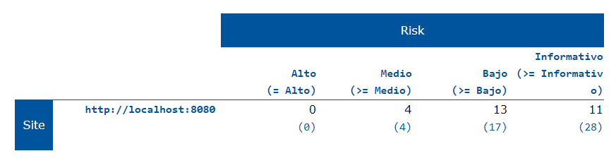
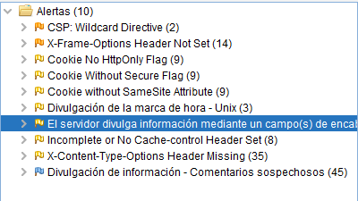
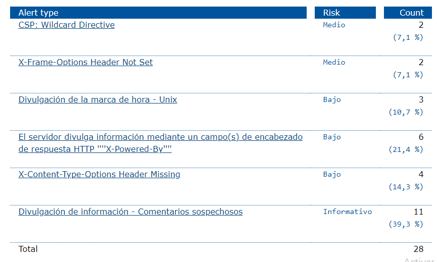

# Proyecto Final Ingenieria de Software II
## Integrantes:

- Aquise Santos Angela 
- Macedo Huaman Vanessa Mayra
- Tito Jorge
- Villanueva Guerrero Luisa
- Huertas Canaza Jim Leonardo

 <p align="center">
    
</p>

## Code Smells
## Expected a `for-of` loop instead of a `for` loop with this simple iteration.
Si tiene un iterable, como una matriz, conjunto o lista, su mejor opción para recorrer sus valores es la sintaxis for que itere entre esas variables. Usando un contador obtendrá mismo comportamiento, pero el código no será tan limpio o claro.

<p align="center">
    
</p>

### Refactor this function to reduce its Cognitive Complexity from 20 to the 15 allowed.
La complejidad cognitiva es una medida de qué tan difícil es comprender el flujo de control de una función. Las funciones con alta complejidad cognitiva serán difíciles de mantener.
<p align="center">
    
</p>
<p align="center">
    
</p>


## Refactoring code smells
### Expected a `for-of` loop instead of a `for` loop with this simple iteration.

<p align="center">
    
</p>


### COMPOSING METHODS:  5. Introduce Explaining Variable
before
<p align="center">
    
</p>
after
<p align="center">
    
</p>

### FUNCTIONS SHOULD NOT BE EMPTY
Hay varias razones para que una función no tenga un cuerpo de función:
- Es una omisión involuntaria y debe corregirse para evitar un comportamiento inesperado en la producción.
- Aún no se admite, o nunca lo será. En este caso, debería lanzarse una excepción en los idiomas donde ese mecanismo está disponible.
- El método es una anulación intencionalmente en blanco. En este caso, un comentario anidado debería explicar el motivo de la anulación en blanco.

Solucion de compilacion
<p align="center">
    
</p>
Ejemplos:

- Before arrow function
<p align="center">
    
</p>

- After arrow function
<p align="center">
    
</p>

- Before method
<p align="center">
    
</p>

- After method
<p align="center">
    
</p>


## [Pipeline de CI/CD](jenkinsfile)

#### Requisitos

:heavy_check_mark: Jenkins Plugins
* [PipeLine](https://plugins.jenkins.io/workflow-aggregator/)
* [Jenkins NodeJS plugin v14.8](https://plugins.jenkins.io/git-parameter/)
* [Jenkins BlueOcean](https://plugins.jenkins.io/blueocean/)
* [Git Parameter](https://plugins.jenkins.io/git-parameter/)
* [SonarQube Scanner](https://plugins.jenkins.io/sonar/)

:heavy_check_mark: SonarQube

:heavy_check_mark: SonarScanner

### Pipeline Blue Ocean wiew


### Reporte Sonar Scanner


# Construccion Automatica
Para la construcción automática nos apoyaremos en **Webpack**.

## Instalación
Seguiremos los siguientes pasos para la instalacion de Webpack y las dependencias necesarias para el proyecto.
```
mkdir x-spreadsheet && cd x-spreadsheet
npm init -y
npm install webpack webpack-cli --save-dev

mkdir dist src
touch webpack.config.js


npm install --save-dev file-loader css-loader file-loader
npm install --save-dev html-webpack-plugin
npm install --save-dev clean-webpack-plugin
npm install --save-dev webpack-dev-server
npm install --save-dev webpack-merge

# less
npm install less --save-dev
npm install less-loader --save-dev

npm install eslint --save-dev
./node_modules/.bin/eslint --init # airbnb


# test mocha
npm install --save-dev mocha

# babel
npm install --save-dev babel-loader babel-core babel-preset-env
# for macha
npm install --save-dev babel-register
# npm install --save-dev babel-plugin-transform-runtime
# npm install --save babel-runtime
```
## Configuración
En el archivo **package.json** añadimos el *script* correspondiente para poder ejecutar la construccion automatica .
- **dev:** Para el modo de desarrollo
- **build:** Para el modo de produccion

```
"scripts": {
	"dev": "webpack-dev-server --open --config build/webpack.dev.js",
    "build": "webpack --config build/webpack.prod.js",
}
```
## Ejecución
Para la construcción automática  del modo de desarrollo usamos el comando :

```
npm run dev

```
Para la construcción automática  del modo de produccion usamos el comando :

```
npm run build

```
 <p align="center">
    
</p>

# Pruebas Unitarias


Para las pruebas unitarias xUnit usaremos **Mocha**  y  **Chai**. 

## Instalación
Instalamos Mocha, Chai y plugins para la conexión HTTP.

```
npm install --save-dev mocha chai chai-http
```
## Configuración
En el archivo **package.json** añadimos el *script* correspondiente para poder ejecutar la pruebas unitarias .
```
"scripts": {
	"test": "nyc ./node_modules/mocha/bin/mocha --require @babel/register --recursive test"
}
```
Creamos una carpeta llamada test para alojar los archivos que contendran las pruebas, trabajaremos sobre los archivos:
- formula_test.js
- format_test.js
- alphabet_test.js


## Formulas (formula_test.js)
Se realizaron pruebas unitarias xUnit para evaluar el funcionamientos de las formulas contenidas en el proyecto como:
- SUM
- AVERAGE
- MAX
- MIN
- IF
- AND
- OR
- CONCAT
 <p align="center">
    
</p>

## Formato (formato_test.js)
Se realizaron pruebas unitarias xUnit para evaluar el funcionamientos de las funciones contenidas en el proyecto como:
- Percent
- Number
- USD
- EUR
- RMB
- Normal
- Text
 <p align="center">
    
</p>

## Formato (alphabet_test.js)
Se realizaron pruebas unitarias xUnit para evaluar el funcionamientos de las funciones contenidas en el proyecto como:
- Index_At
- String_At

> Index_At

<p align="center">
    
</p>

> String_At

<p align="center">
    
</p>

## Casos de Prueba
<p align="center">
    
</p>

# Prueba de Seguridad - Owasp Zap

- Atacamos el proyecto utilizando Owasp Zap
<p align="center">
    
</p>

## Riesgo de la Pagina

<p align="center">
    
</p>

## Reporte de las Alertas Obtenidas

<p align="center">
    
</p>

## Tipo de Riesgos de las Alertas

<p align="center">
    
</p>

## Analizamos las Alertas
### CSP: Wildcard Directive (Riesgo Medio)
- The following directives either allow wildcard sources (or ancestors), are not defined, or are overly broadly defined:

frame-ancestors, form-action

- The directive(s): frame-ancestors, form-action are among the directives that do not fallback to default-src, missing/excluding them is the same as allowing anything.

### X-Frame-Options Header Not Set (Riesgo Medio)
- El encabezado X-Frame-Options no se incluye en la respuesta HTTP para proteger contra ataques 'ClickJacking'.

### El servidor divulga información mediante un campo(s) de encabezado de respuesta HTTP ''''X-Powered-By'''' (Riesgo Bajo)
- El servidor de la web/aplicación está divulgando información mediante uno o más encabezados de respuesta HTTP ''''X-Powered-By''''. El acceso a tal información podría facilitarle a los atacantes la identificación de otros marcos/componentes de los que su aplicación web depende y las vulnerabilidades a las que pueden estar sujetos tales componentes.

### X-Content-Type-Options Header Missing (Riesgo Bajo)
- El encabezado Anti-MIME-Sniffing X-Content-Type-Options no se estableció en 'nosniff'. Esto permite que las versiones anteriores de Internet Explorer y Chrome realicen un rastreo de MIME en el cuerpo de la respuesta, lo que podría hacer que el cuerpo de la respuesta se interprete y muestre como un tipo de contenido distinto del tipo de contenido declarado. Las versiones actuales (principios de 2014) y heredadas de Firefox usarán el tipo de contenido declarado (si se establece uno), en lugar de realizar un rastreo de MIME.

### Divulgación de la marca de hora - Unix (Riesgo Bajo)
- Una marca de tiempo ha sido divulgada por el servidor de la aplicación/el navegador - Unix

## Posibles Soluciones de cada Alerta

### CSP: Wildcard Directive (Riesgo Medio)
- Asegúrese de que su servidor web, servidor de aplicaciones, equilibrador de carga, etc. Esté configurado correctamente para establecer el encabezado Content-Security-Policy.

### X-Frame-Options Header Not Set (Riesgo Medio)
- La mayoría de los navegadores web modernos admiten el encabezado HTTP X-Frame-Options. Asegúrese de que esté configurado en todas las páginas web devueltas por su sitio (si espera que la página esté enmarcada solo por páginas en su servidor (por ejemplo, es parte de un FRAMESET), entonces querrá usar SAMEORIGIN; de lo contrario, si nunca espera la página para ser enmarcado, debe usar DENY. Alternativamente, considere implementar la directiva "frame-ancestors" de la Política de seguridad de contenido.

### El servidor divulga información mediante un campo(s) de encabezado de respuesta HTTP ''''X-Powered-By'''' (Riesgo Bajo)
- Asegúrese que su servidor web, servidor de aplicación, equilibrador de carga, etc. está configurado para suprimir encabezados ''''X-Powered-By".

### X-Content-Type-Options Header Missing (Riesgo Bajo)
- Asegúrese de que la aplicación / servidor web establezca el encabezado Content-Type de manera adecuada y que establezca el encabezado X-Content-Type-Options en 'nosniff' para todas las páginas web.

- Si es posible, asegúrese de que el usuario final utilice un navegador web moderno y que cumpla con los estándares que no realice el rastreo de MIME en absoluto, o que pueda ser dirigido por la aplicación web / servidor web para que no realice el rastreo de MIME.

### Divulgación de la marca de hora - Unix (Riesgo Bajo)
- Confirmar manualmente que los datos de marca de hora no son sensibles, y que los datos no pueden ser agregados a patrones explotables de divulgación.


