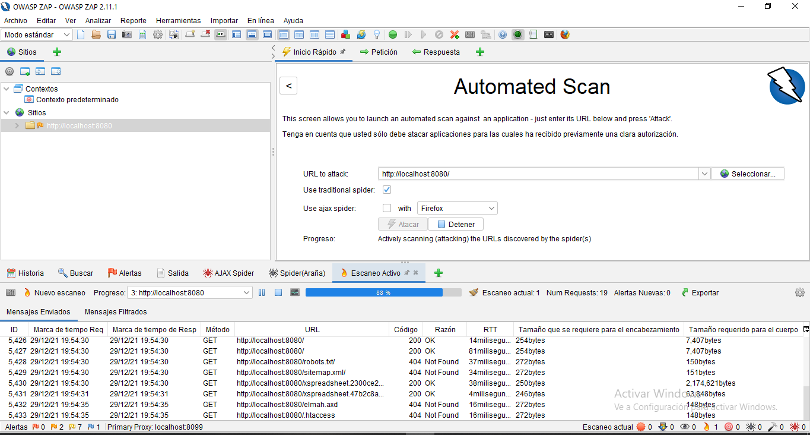

# Proyecto Final Ingenieria de Software II
## Integrantes:

- Aquise Santos Angela 
- Macedo Huaman Vanessa Mayra
- Tito Jorge
- Villanueva Guerrero Luisa
- Huertas Canaza Jim Leonardo

## [Pipeline de CI/CD](jenkinsfile)

#### Requisitos

:heavy_check_mark: Jenkins Plugins
* [PipeLine](https://plugins.jenkins.io/workflow-aggregator/)
* [Jenkins NodeJS plugin v14.8](https://plugins.jenkins.io/git-parameter/)
* [Jenkins BlueOcean](https://plugins.jenkins.io/blueocean/)
* [Git Parameter](https://plugins.jenkins.io/git-parameter/)
* [SonarQube Scanner](https://plugins.jenkins.io/sonar/)

:heavy_check_mark: SonarQube

:heavy_check_mark: SonarScanner

### Pipeline Blue Ocean wiew

### Reporte Sonar Scanner

## Construccion Automatica

# Code Smells
## Expected a `for-of` loop instead of a `for` loop with this simple iteration.
Si tiene un iterable, como una matriz, conjunto o lista, su mejor opción para recorrer sus valores es la sintaxis for que itere entre esas variables. Usando un contador obtendrá mismo comportamiento, pero el código no será tan limpio o claro.

    

## Refactor this function to reduce its Cognitive Complexity from 20 to the 15 allowed.
La complejidad cognitiva es una medida de qué tan difícil es comprender el flujo de control de una función. Las funciones con alta complejidad cognitiva serán difíciles de mantener.

    

    

# Refactoring code smells
## Expected a `for-of` loop instead of a `for` loop with this simple iteration.

    

### COMPOSING METHODS:  5. Introduce Explaining Variable
before

    

after

    

### FUNCTIONS SHOULD NOT BE EMPTY
Hay varias razones para que una función no tenga un cuerpo de función:
- Es una omisión involuntaria y debe corregirse para evitar un comportamiento inesperado en la producción.
- Aún no se admite, o nunca lo será. En este caso, debería lanzarse una excepción en los idiomas donde ese mecanismo está disponible.
- El método es una anulación intencionalmente en blanco. En este caso, un comentario anidado debería explicar el motivo de la anulación en blanco.

Solucion de compilacion

    

Ejemplos:

- Before arrow function

    

- After arrow function

    

- Before method

    

- After method

    

# Prueba de Seguridad - Owasp Zap

- Atacamos el proyecto utilizando Owasp Zap

    

