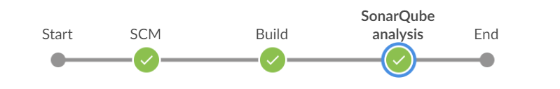
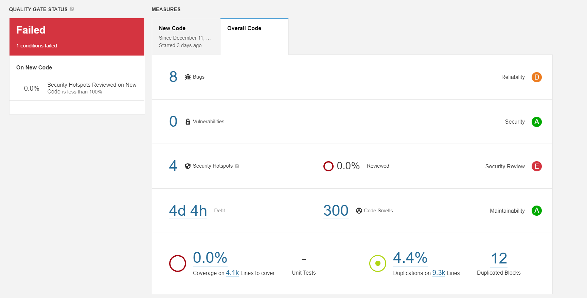

# Proyecto Final Ingenieria de Software II
## Integrantes:

- Aquise Santos Angela
- Macedo Huaman Vanessa Mayra
- Tito Jorge
- Villanueva Guerrero Luisa
- Huertas Canaza Jim Leonardo

=======
## [Pipeline de CI/CD](jenkinsfile)

#### Requisitos

:heavy_check_mark: Jenkins Plugins
* [PipeLine](https://plugins.jenkins.io/workflow-aggregator/)
* [Jenkins NodeJS plugin v14.8](https://plugins.jenkins.io/git-parameter/)
* [Jenkins BlueOcean](https://plugins.jenkins.io/blueocean/)
* [Git Parameter](https://plugins.jenkins.io/git-parameter/)
* [SonarQube Scanner](https://plugins.jenkins.io/sonar/)

:heavy_check_mark: SonarQube

:heavy_check_mark: SonarScanner

### Pipeline Blue Ocean wiew

### Reporte Sonar Scanner

## Construccion Automatica

### COMPOSING METHODS:  5. Introduce Explaining Variable
before

    

after

    

